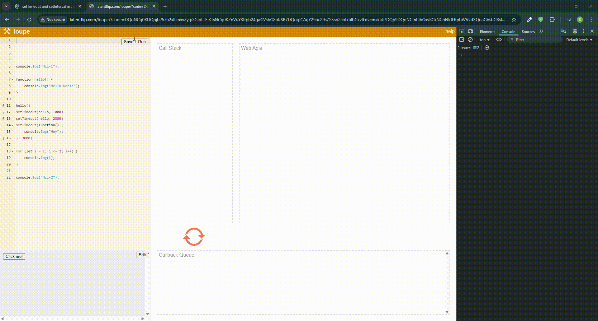

# ⏳ JavaScript Timers and Event Loop Demo

This project demonstrates how JavaScript handles asynchronous functions using `setTimeout`, `setInterval`, and the **Event Loop** mechanism.

## 📸 Demo Preview

The image below shows the **JavaScript Event Loop** in action, explaining how timers move between Call Stack, Web APIs, and Callback Queue:

### `setTimeout(function, delay)`
- Runs the function **once** after the specified delay (in milliseconds).

### `setInterval(function, delay)`
- Runs the function **repeatedly** every specified delay (in milliseconds).

## 🧠 How It Works (JavaScript Event Loop)

JavaScript is single-threaded but handles asynchronous tasks using the **Event Loop**, which works in **three phases**:

1. **Call Stack** – Executes synchronous code line-by-line.
2. **Web APIs** – Browser manages timers and async tasks.
3. **Callback Queue** – After completion, the callback waits here.

The **Event Loop** constantly checks the call stack. If it's empty, it pushes the callback from the queue to be executed.

## ✅ Key Points

- `setTimeout(fn, 0)` doesn't run instantly—it runs **after the current call stack clears**.
- Timers are **Web API features**, not part of JavaScript’s core engine.
- Cancel timers with `clearTimeout()` or `clearInterval()`.

---

